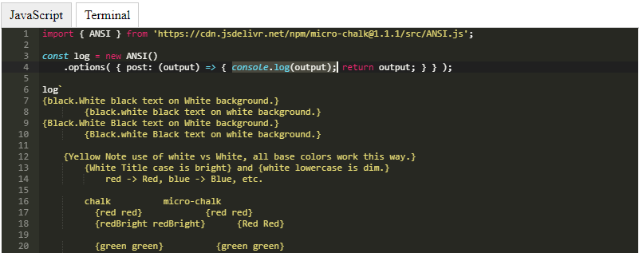
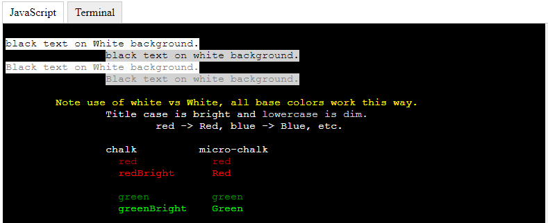

# ace-xterm web component
A Web Component Combining Ace Editor with an XTerm Terminal as the output target.  Should work in any
modern browser supporting web components, you may need to use a polyfill if you're targeting some
browsers.

Tested in Chrome 71+ & Firefox 64+.





### Usage

Include the script in your header:
```html
<script src="ace-xterm.wc.js" type="module"></script>
```

Use an `<ace-xterm>` HTML tag in your document.  Text within the tag will
become the code shown in the ace editor upon initialization.

```html
<ace-xterm>
    import { ANSI } from 'https://cdn.jsdelivr.net/npm/micro-chalk@1.1.1/src/ANSI.js';

    const log = new ANSI()
        .options( { post: (output) => { console.log(output); return output; } } );

    log`
    {black.White black text on White background.}
            {black.white black text on white background.}
    {Black.White Black text on White background.}
            {Black.white Black text on white background.}

        {Yellow Note use of white vs White, all base colors work this way.}
            {White Title case is bright} and {white lowercase is dim.}
                red -> Red, blue -> Blue, etc.

            chalk          micro-chalk
              {red red}            {red red}
              {redBright redBright}      {Red Red}

              {green green}          {green green}
              {greenBright greenBright}    {Green Green}

              {bgBlue bgBlue}         {.blue .blue}
              {bgBlueBright bgBlueBright}   {.Blue .Blue}

              {bgRed bgRed}          {.red .red}
              {bgRedBright bgRedBright}    {.Red .Red}


    {.Red Sample of White on Red.}
            {.red Sample of White on red.}
    {.Blue Sample of White on Blue.}
            {.blue Sample of White on blue.}
    `;
</ace-xterm>
```

See the [demo.html](src/demo.html) page for a complete example.
